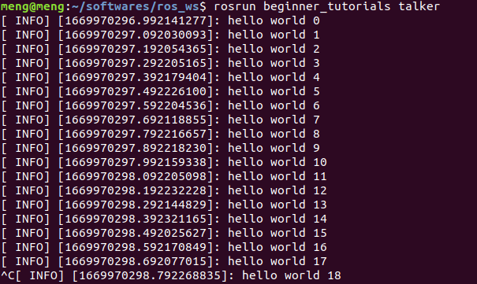

# ros_tricks
## 1 while(ros::ok()) usage example
### (1) run one terminal
`roscore`
### (2) run another terminal 
```
mkdir ros_ws
cd ros_ws
git clone https://github.com/biter0088/ros_tricks.git
catkin_make
rosrun beginner_tutorials talker
```
<div align=center></div>

### (3) further information(中文示例)
CSDN:https://blog.csdn.net/BIT_HXZ/article/details/128150185